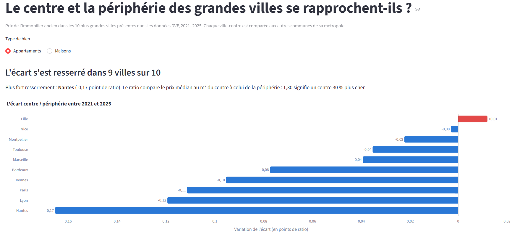

# analyse-immobilier-dvf

> Comment les prix de l'immobilier ont-ils évolué dans les grandes villes françaises depuis
> cinq ans, et où l'écart entre le centre et la périphérie se creuse-t-il le plus ?

[](https://github.com/eliasbabouche/analyse-immobilier-dvf/actions/workflows/tests.yml)
[](https://analyse-immobilier-dvf.streamlit.app)
[](https://colab.research.google.com/github/eliasbabouche/analyse-immobilier-dvf/blob/main/notebooks/01_restitution.ipynb)

## Résultat

**Démo en ligne : [analyse-immobilier-dvf.streamlit.app](https://analyse-immobilier-dvf.streamlit.app)**
(si l'application est en veille, cliquer sur le bouton de réveil : environ 30 secondes)

**Notebook de restitution : [`notebooks/01_restitution.ipynb`](notebooks/01_restitution.ipynb)**,
le raisonnement pas à pas, lisible directement sur GitHub (ou exécutable dans Colab).



**L'écart entre le centre et la périphérie ne se creuse pas : il se resserre, nettement pour
les appartements.** Entre 2021 et 2025, le prix médian au m² des appartements a davantage baissé
dans la ville-centre que dans le reste de sa métropole, dans 9 villes sur 10.

| Appartements, prix médian au m² | Centre 2021 → 2025 | Périphérie 2021 → 2025 | Ratio centre / périphérie |
|---|---|---|---|
| Nantes | 3 831 € → 3 390 € (−11,5 %) | 2 958 € → 3 000 € (+1,4 %) | 1,30 → 1,13 |
| Lyon | 5 064 € → 4 470 € (−11,7 %) | 3 469 € → 3 333 € (−3,9 %) | 1,46 → 1,34 |
| Paris | 10 882 € → 9 729 € (−10,6 %) | 5 590 € → 5 300 € (−5,2 %) | 1,95 → 1,84 |
| Lille, seule exception | 3 718 € → 3 708 € (−0,3 %) | 2 614 € → 2 586 € (−1,1 %) | 1,42 → 1,43 |

Pour les **maisons**, le résultat est plus contrasté : l'écart se resserre fortement à Paris,
Rennes et Lyon, mais se creuse légèrement à Nice, Marseille ou Bordeaux. À Marseille et
Montpellier, la périphérie (Aix-en-Provence, Cassis…) est même plus chère que le centre.

Le dashboard permet d'explorer chaque ville, jusqu'à la commune.

## Deux choix de méthode qui changent le résultat

- **Raisonner par vente, et non par ligne.** Dans le DVF, une vente de plusieurs biens (un
  appartement, sa cave, son parking) occupe plusieurs lignes, et le prix total de la vente est
  répété sur chacune. Additionner ou moyenner les lignes compte ce prix plusieurs fois : le volume
  des ventes de Loire-Atlantique passe de 7,4 à 30 Md€, et le prix moyen au m² des appartements
  nantais est surévalué de 177 %. Le nettoyage ne garde donc qu'une ligne par vente, pour les
  seules ventes d'un logement unique (94 % des ventes contenant un logement), et les résultats
  reposent sur la médiane, peu sensible aux erreurs qui subsisteraient. Des tests verrouillent ce
  traitement, y compris l'ordre des étapes : compter les logements d'une vente avant d'écarter
  les surfaces nulles, sans quoi une vente de deux appartements passerait pour une vente d'un seul.
- **Comparer à type de bien égal.** Le centre vend surtout des appartements (80 % des ventes à
  Nantes), la périphérie beaucoup de maisons (41 % d'appartements seulement). Mélanger les deux
  mesure la composition du marché autant que l'effet du lieu : à Nantes en 2021, le prix au m² du
  centre dépasse celui de la périphérie de 20 % tous biens confondus, mais de 30 % à type de bien
  égal. L'écart réel serait sous-estimé d'un tiers. Appartements et maisons sont donc toujours
  analysés séparément.

## Ce qui a été difficile, et ce que j'en retiens

- **Accepter un résultat qui contredit la question de départ.** Le projet partait de l'idée d'un
  écart qui se creuse ; pour les appartements, les données montrent l'inverse. Plutôt que de
  chercher un découpage qui confirme l'hypothèse, j'ai reformulé la conclusion et publié les
  exceptions (Lille, les maisons de Nice ou de Bordeaux). Avoir écrit la question dans ce README
  avant la première ligne de code m'a empêché de la réécrire après coup.
- **Les erreurs qui ne produisent aucun message d'erreur.** Filtrer Paris sur son code commune
  renvoie zéro vente, car le DVF code Paris, Lyon et Marseille par arrondissement. Écrire à la
  main la liste des départements à télécharger aurait oublié des communes, car le Grand Paris
  s'étend sur six départements et Aix-Marseille sur trois. Inverser deux étapes du nettoyage
  garde à tort des ventes de deux logements. Rien ne plante : les chiffres sont simplement faux.
  D'où deux réflexes : déduire les listes du référentiel officiel au lieu de les écrire, et tester
  chaque règle sur de petits cas fabriqués à la main dont on connaît le bon résultat.
- **Arbitrer entre rigueur et lisibilité.** Le seuil de 30 ventes par médiane laisse une partie
  de la carte en gris ; les bornes fixes de prix écartent quelques ventes de luxe bien réelles ;
  comparer par nombre de pièces serait plus juste, mais trop peu de médianes resteraient fiables.
  À chaque fois, j'ai retenu la règle la plus simple à justifier, et écrit ce qu'elle coûte dans
  les limites ci-dessous.

## Données

| | |
|---|---|
| Source | [Demandes de valeurs foncières géolocalisées](https://www.data.gouv.fr/fr/datasets/demandes-de-valeurs-foncieres-geolocalisees/) (DGFiP, mise en forme Etalab) |
| Complément | Communes de chaque métropole (référentiel INSEE), via l'[API Découpage administratif](https://geo.api.gouv.fr/decoupage-administratif) |
| Volume | ~80 000 lignes pour un département comme la Loire-Atlantique, environ 3 millions par an pour la France |
| Période | 2021 à 2025 (millésime Etalab de décembre 2025, figé) |
| Licence | Licence Ouverte / Open Licence 2.0 |
| Mise à jour | semestrielle (avril et octobre) |

Chaque ligne décrit un bien ou une parcelle d'une vente (une *mutation*) : date, prix, adresse,
type de bien, surface bâtie, nombre de pièces, coordonnées GPS.

Les données brutes ne sont pas versionnées. Pour les récupérer :

```bash
python -m src.telecharger_donnees
```

## Méthode

**Périmètre.** Les dix plus grandes villes de France présentes dans le DVF : Paris, Marseille,
Lyon, Toulouse, Nice, Nantes, Montpellier, Bordeaux, Lille, Rennes. Pour chacune, on compare la
**ville-centre** aux **autres communes de sa métropole** (son EPCI, regroupement officiel de
communes défini par l'INSEE).

1. **Téléchargement** des fichiers départementaux utiles uniquement, année par année, pour ne
   jamais charger la France entière en mémoire.
2. **Nettoyage**, le cœur du projet :
   - ne garder que les ventes classiques (`nature_mutation = Vente`) : les échanges,
     adjudications, expropriations et ventes sur plan (VEFA) ne reflètent pas le prix de
     marché de l'ancien ;
   - **raisonner par vente et non par ligne** (voir ci-dessous) ;
   - ne garder que les ventes contenant **exactement un logement** (maison ou appartement),
     dépendances comprises ;
   - écarter les prix et surfaces nuls ou manquants, puis les prix au m² aberrants.
3. **Rattachement géographique** : les arrondissements de Paris, Lyon et Marseille sont
   ramenés à leur commune, puis chaque commune est rattachée à sa métropole.
4. **Agrégation** : prix médian au m² par commune, par année et par type de bien.
5. **Restitution** : dashboard Streamlit et notebook.

### Le piège des ventes multi-lots

Une vente qui comprend plusieurs biens (un appartement, une cave, un parking) apparaît sur
plusieurs lignes, et **le prix total de la vente est répété sur chacune d'elles**. Mesuré sur
la Loire-Atlantique en 2025 :

| Indicateur | Calcul naïf (par ligne) | Calcul correct (par vente) | Écart |
|---|---|---|---|
| Volume total des ventes | 30,0 Md€ | 7,4 Md€ | ×4,1 |
| Prix **moyen** au m², appartements à Nantes | 9 555 € | 3 450 € | +177 % |
| Prix **médian** au m², appartements à Nantes | 3 516 € | 3 390 € | +4 % |

Deux protections complémentaires en découlent : dédoublonner par vente, et travailler sur la
**médiane**, peu sensible aux valeurs extrêmes qui subsisteraient.

### Choix assumés et limites

- **Ventes à plusieurs logements écartées** (6 % des ventes contenant un logement dans les
  dix métropoles) : leur prix global ne peut pas être réparti entre les logements. Ce sont
  souvent des ventes en bloc à des investisseurs, dont l'exclusion peut légèrement biaiser les
  résultats.
- **Comparaison à type de bien égal, mais pas à taille égale** : appartements et maisons ne
  sont jamais mélangés (le centre vend surtout des appartements, la périphérie beaucoup de
  maisons), mais un studio du centre reste comparé à un T4 de périphérie. Affiner par nombre
  de pièces ferait passer trop de médianes sous le seuil de 30 ventes.
- **Neuf exclu** : les ventes sur plan (VEFA) suivent un marché distinct. Les résultats portent
  sur l'ancien.
- **Strasbourg absente** : l'Alsace et la Moselle relèvent du livre foncier et ne sont pas
  publiées dans le DVF. Rennes la remplace dans le top 10.
- **La métropole comme périphérie** : un découpage administratif, simple et vérifiable, mais qui
  varie beaucoup en taille d'une ville à l'autre (la métropole d'Aix-Marseille compte près de
  cent communes, Rennes Métropole beaucoup moins).
- **Source retraitée** : la version géolocalisée d'Etalab est une mise en forme du fichier brut
  de la DGFiP, et non la publication officielle elle-même.

## Exécution

```bash
python -m venv .venv
.venv\Scripts\activate
pip install -r requirements.txt
streamlit run app.py
```

## Tests

```bash
pytest
```

## Structure

```
src/          code métier, une responsabilité par module
tests/        tests unitaires
notebooks/    restitution : importe depuis src/, ne contient pas de logique métier
donnees/      brut/ et traite/ (non versionnés), reference/ et agrege/ (petits, versionnés)
```

Les tableaux de `donnees/agrege/` sont versionnés pour que le dashboard en ligne n'ait pas à
retélécharger et nettoyer les données. Toute modification du nettoyage impose de les régénérer
(`python -m src.nettoyage` puis `python -m src.agregations`) et de les commiter.

Le code vit dans `src/` et reste testable ; le notebook importe depuis `src/` et raconte
l'histoire. Ses sorties sont volontairement conservées dans le fichier pour que les
graphiques s'affichent sur GitHub sans rien exécuter.

## Questions fréquentes

<details>
<summary><b>Pourquoi la médiane plutôt que la moyenne ?</b></summary>

Parce que la moyenne est ruinée par les erreurs qui subsistent après nettoyage, alors que la
médiane les absorbe. Le tableau du piège multi-lots le montre : sur les appartements nantais,
passer d'un calcul par ligne à un calcul par vente corrige la **moyenne de +177 %**
(9 555 € → 3 450 € le m²), mais la **médiane de +4 %** seulement (3 516 € → 3 390 €).

Autrement dit, un nettoyage imparfait combiné à une médiane donne un résultat à peu près
juste, là où le même nettoyage combiné à une moyenne donne un résultat absurde. Je garde les
deux protections plutôt qu'une : je dédoublonne par vente *et* je travaille sur la médiane.

</details>

<details>
<summary><b>Pourquoi ne pas simplement additionner les prix du fichier ?</b></summary>

Parce qu'une vente qui comprend plusieurs biens — un appartement, sa cave, son parking —
occupe plusieurs lignes, et **le prix total de la vente est répété sur chacune**. Les
additionner revient à compter la même transaction trois fois.

L'effet n'est pas marginal : sur la Loire-Atlantique en 2025, le volume total des ventes
passe de 7,4 Md€ (calcul correct) à 30,0 Md€ (calcul naïf), soit un facteur 4,1.

Le nettoyage ne conserve donc qu'une ligne par vente, et ne garde que les ventes contenant
exactement un logement — 94 % des ventes contenant au moins un logement. Des tests
verrouillent ce traitement, y compris **l'ordre des étapes** : il faut compter les logements
d'une vente *avant* d'écarter les surfaces nulles, sinon une vente de deux appartements dont
l'un a une surface manquante passe pour une vente d'un seul.

</details>

<details>
<summary><b>Pourquoi analyser les appartements et les maisons séparément ?</b></summary>

Parce que les mélanger mesure la composition du marché autant que l'effet du lieu. À Nantes,
les appartements représentent 80 % des ventes dans la ville-centre contre 41 % dans le reste
de la métropole : comparer les deux zones tous biens confondus, c'est comparer un marché
d'appartements à un marché de maisons.

Le chiffre qui tranche : à Nantes en 2021, le centre dépasse la périphérie de **20 % tous
biens confondus, mais de 30 % à type de bien égal**. L'écart réel serait sous-estimé d'un
tiers.

</details>

<details>
<summary><b>Le résultat contredit l'intuition — comment savoir qu'il est juste ?</b></summary>

Il la contredit effectivement : je partais de l'idée d'un écart centre-périphérie qui se
creuse, et pour les appartements les données montrent l'inverse, dans 9 villes sur 10.

Trois éléments me font tenir ce résultat. D'abord, la question de départ est écrite en tête
de ce README **depuis avant la première ligne de code** — ce qui m'a empêché de la réécrire
après coup pour qu'elle colle à ce que je trouvais. Ensuite, je publie les exceptions plutôt
que de les lisser : Lille ne suit pas la tendance (ratio 1,42 → 1,43), et sur les maisons
l'écart se creuse à Nice, Marseille et Bordeaux. Enfin, l'effet est massif et cohérent d'une
ville à l'autre — Nantes 1,30 → 1,13, Lyon 1,46 → 1,34, Paris 1,95 → 1,84 — ce qui serait
surprenant pour un artefact de traitement.

Un résultat conforme à l'intuition mérite d'ailleurs autant de méfiance : c'est celui qu'on
ne vérifie pas.

</details>

<details>
<summary><b>Comment se protéger des erreurs qui ne déclenchent aucun message ?</b></summary>

C'est la difficulté principale du projet : les erreurs les plus coûteuses ne font rien
planter, elles rendent simplement les chiffres faux.

Trois exemples rencontrés. Filtrer Paris sur son code commune renvoie zéro vente, parce que
le DVF code Paris, Lyon et Marseille par arrondissement. Écrire à la main la liste des
départements à télécharger aurait oublié des communes, parce que le Grand Paris s'étend sur
six départements et Aix-Marseille sur trois. Et inverser deux étapes du nettoyage conserve à
tort des ventes de deux logements.

D'où deux réflexes systématiques : **déduire les listes d'un référentiel officiel** (ici
l'API Découpage administratif de l'INSEE) au lieu de les écrire, et **tester chaque règle sur
de petits cas fabriqués à la main** dont je connais le résultat attendu. J'ai aussi vérifié
que chaque test échoue bien quand je casse volontairement le code qu'il couvre — un test qui
reste vert sur du code faux ne teste rien.

</details>

<details>
<summary><b>Pourquoi définir la périphérie comme le reste de la métropole ?</b></summary>

C'est un découpage administratif officiel (l'EPCI défini par l'INSEE), donc simple à
expliquer, reproductible et vérifiable par n'importe qui. Une définition par distance au
centre aurait demandé de fixer un rayon arbitraire, difficile à justifier et différent pour
chaque ville.

La limite, que j'assume : les métropoles varient beaucoup en taille. Aix-Marseille compte
près de cent communes, Rennes Métropole bien moins — les « périphéries » comparées ne sont
donc pas homogènes. C'est visible dans les résultats : à Marseille et Montpellier, la
périphérie (Aix-en-Provence, Cassis) est plus chère que le centre.

Même logique pour les autres arbitrages du projet : à chaque fois j'ai retenu la règle la
plus simple à justifier, et écrit ce qu'elle coûte dans les limites.

</details>

## Licence

MIT — voir [LICENSE](LICENSE).
